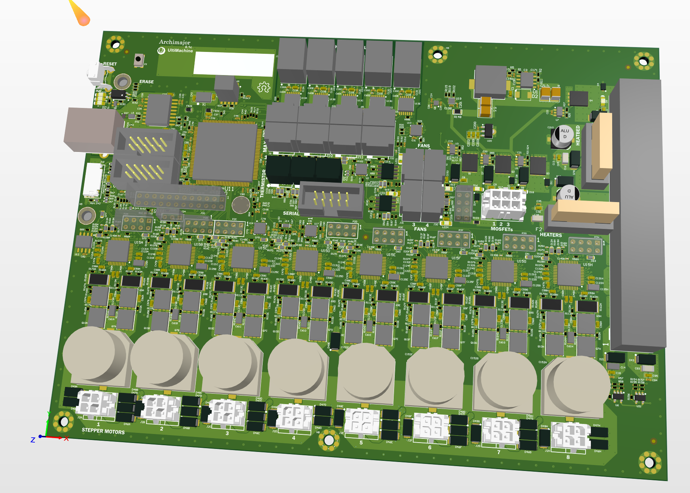

# Archimajor

## Summary

3D printer motherboard, designed by [Ultimachine](https://ultimachine.com/). Features include:

- **5x integrated 256 microstep motor drivers**
- **6x PWM Mosfet outputs**
- **4x thermistor inputs**
- **SPI (Serial Peripheral Interface)**

---

## Specifications

### General Specifications

**Input Power Supply**: 12V - 24V DC, 16A+

**Operating Temperature Range (est.)**: 0dC ~ 70dC

## Firmware

[Source](https://github.com/ultimachine/Marlin4due/tree/Archim2)

[Binary](https://github.com/MarlinFirmware/Marlin/archive/bugfix-2.0.x.zip)

## Bill of Materials

[Archimajor.csv](./Archimajor.csv)

## Disclaimer

*NOTE: This does not represent actual data from the Rambo/Archimajor PCBA
